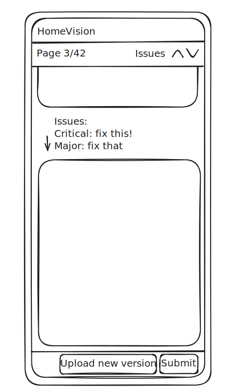

# HomeVision Frontend Take-Home Challenge

Implementation of the **Review Page** for the HomeVision frontend take-home challenge. The app displays a PDF document
alongside backend-detected issues, letting users review them before submitting a revised version.

**[Live demo →](https://homevision-dylan-take-home.vercel.app/)**

---

## Preview

https://github.com/user-attachments/assets/82e5f3ca-f578-4e84-aff7-863c62c61b93

---

## Quick start

```bash
npm install
npm run dev
```

Open [http://localhost:3000](http://localhost:3000). The repository already includes the sample PDF and mocked review
data from the challenge — no additional setup required.

To run linter and tests:

```bash
npm run lint
npm run test:coverage
```

---

## How to evaluate

1. Open the homepage and click **Review PDF File**.
2. Scroll through the document.
3. Use the **Issue Navigator** (top-right) to jump between pages containing issues.
4. Search for text with **Ctrl+F / Cmd+F** — both the PDF content and issue descriptions are searchable.
5. Resize the browser window to verify responsive behavior.
6. Navigate the entire interface using only the keyboard.

---

## UX exploration



The core layout decision was to arrange everything **vertically** rather than using a side panel.

This means each issue appears directly above the page it relates to, creating a natural top-to-bottom reading flow. The
main alternatives I considered — a fixed side panel and an overlay drawer — both have meaningful downsides when issues
are page-level rather than position-level:

- A **side panel** permanently reserves horizontal space even on pages without issues, and has to account for when an
  issue description is taller than the page itself.
- An **overlay drawer** obscures the document and requires an extra click to view.

The vertical layout avoids both problems and also adapts naturally to mobile and tablet without any additional
breakpoint handling.

---

## Tech stack

|                   |            |
|-------------------|------------|
| **Framework**     | Next.js 16 |
| **Language**      | TypeScript |
| **UI**            | React 19   |
| **PDF rendering** | react-pdf  |

Next.js is the framework I'm most comfortable with and gives a clean project structure out of the box. For PDF rendering
I evaluated the available ecosystem and chose **react-pdf** for two reasons: it's the most widely adopted solution for
React, and it renders the PDF text layer — which is what makes native Ctrl+F search work across both the document and
the issue descriptions, a listed acceptance criterion.

---

## Architecture

### `Review` page

It owns the mocked review data, holds the minimal shared state (`currentPage` and `pageCount`),
and coordinates communication between the two sibling components below:

### `AnnotatedPdfViewer`

A generic, reusable PDF viewer that accepts arbitrary page annotations as a `ReactNode` collection keyed by page
number — keeping it decoupled from any product-specific logic.

It exposes two integration points:

- `onPageFocus(page)` — fires when a new page becomes the most visible in the viewport, so the parent can track the
  current page.
- `jumpToPage(page)` via a ref — lets external controls navigate the document without coupling the viewer to any
  specific navigation UI.

### `IssueNavigator`

Displays the current page and total page count, and provides previous/next buttons to jump between pages that contain
issues.

---

## Key design decisions

### Page visibility tracking

An `IntersectionObserver` watches all rendered pages and tracks whichever one occupies the largest portion of the
viewport at any moment. This single mechanism drives the "Page X of Y" counter and the state of the
previous/next issue buttons.

### Native document search

The app renders the PDF text layer so the browser's native Ctrl+F covers
both the document content and the issue descriptions simultaneously.

### Smooth resizing

A naïve implementation re-rendered pages continuously while the browser was being resized, causing noticeable
flickering. The approach here instead:

1. Swaps the PDF out for a same-width placeholder that resizes instantly.
2. Waits for the viewport width to stabilize (debounce).
3. Re-renders the PDF at the new size.
4. Removes the placeholder after a short delay, giving the PDF time to paint.

The result is a noticeably smoother experience with relatively simple code — probably the implementation detail I'm
happiest with in this project.

---

## Accessibility

- Full keyboard navigation throughout the interface.
- Responsive layout for mobile, tablet, and desktop.
- Contrast ratios and interactive target sizes checked iteratively during development.
- Native browser search support (no custom implementation needed).

---

## Testing

Tests use **Jest** and are focused on the two most complex components — `AnnotatedPdfViewer` and `IssueNavigator`. For a
take-home project this coverage (~60% of branches across all files) feels proportionate; in a production codebase I'd
expand it, though the remaining components are simple enough that there's not a great deal left to cover.

---

## Future improvements

### PDF virtualization

Currently, every page is rendered up front. For large documents, the next step would be virtualizing page rendering —
though this conflicts with native Ctrl+F, since replacing off-screen pages with placeholders removes their text from the
DOM.

A workable approach would be to virtualize only the rendered canvases while keeping the text layer mounted.
This preserves searchability without rendering every page visually.

### Production readiness

- Replace mocked data with real backend API integration.
- Skeleton loading state to replace the plain-text placeholder.
- Monitoring.
- End-to-end tests.
